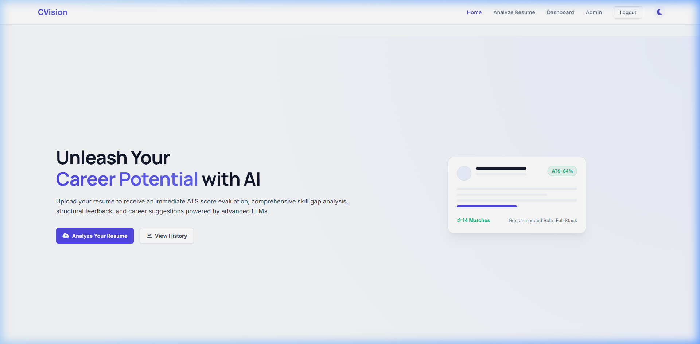
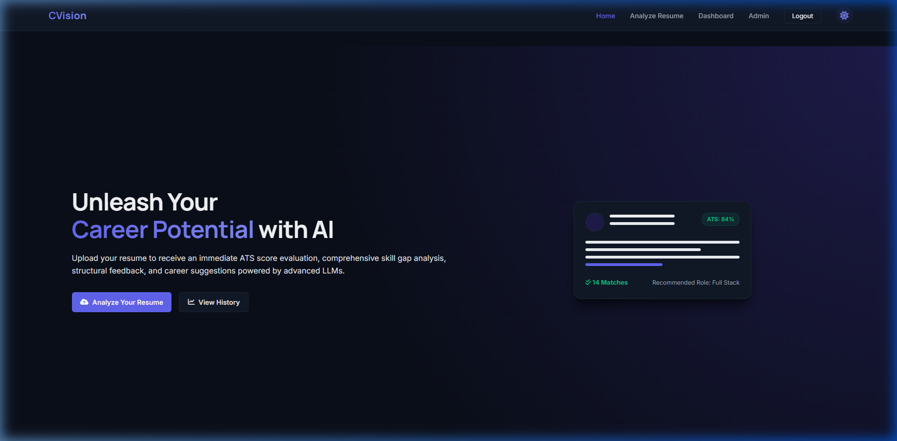
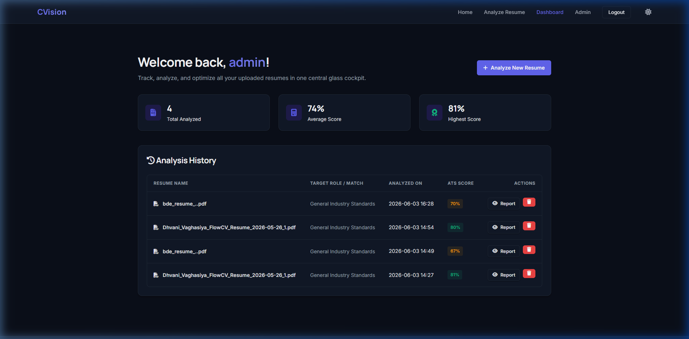
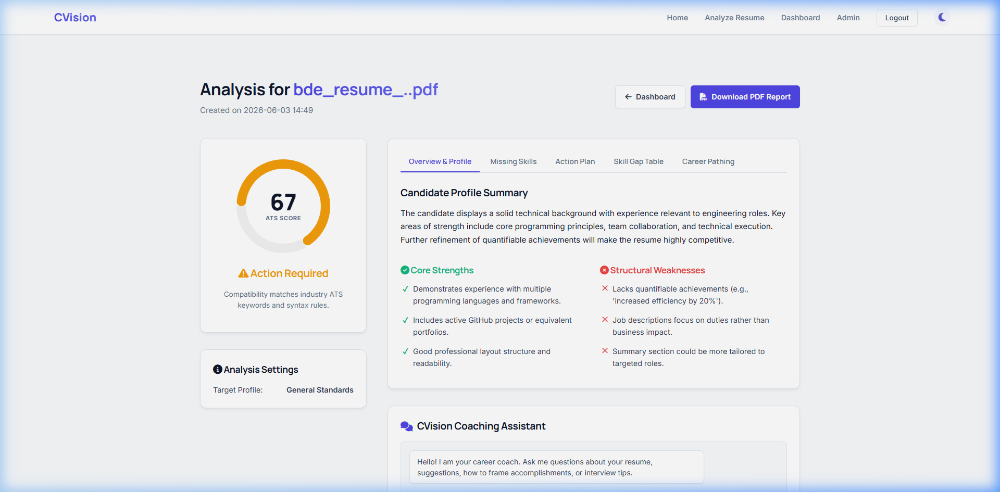
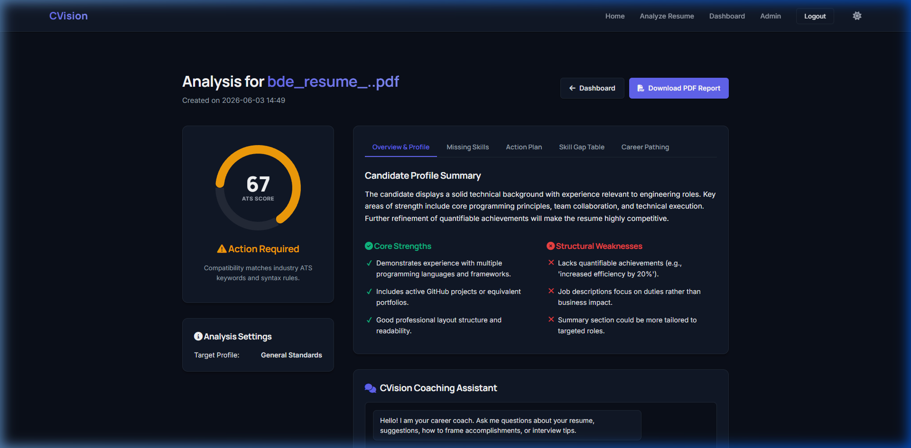
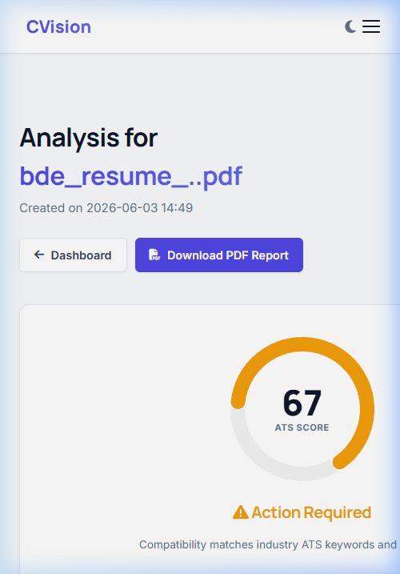
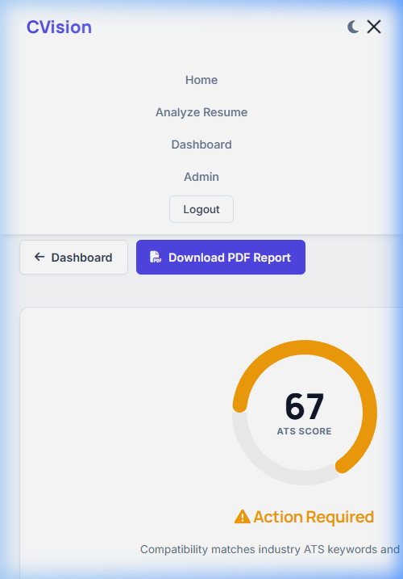

# CVision: AI Resume Analyzer

**CVision** is a resume analyzer that helps job seekers check and optimize their resumes for Applicant Tracking Systems (ATS). Powered by the Groq API, it parses uploaded resumes, calculates ATS compatibility scores, identifies skill gaps, and includes an AI career assistant for resume recommendations.

---

## Features

* **ATS Score Analysis:** Calculates ATS compatibility scores and displays them using an interactive gauge.
* **AI Resume Feedback:** Analyzes resume structure, content weaknesses, and formatting issues.
* **Skill Gap Detection:** Identifies missing technical and soft skills based on the target role.
* **Resume Upload System:** Drag-and-drop file uploader for PDF and DOCX formats.
* **Dashboard Analytics:** Visual logs of previous resume analyses and scores over time.
* **PDF Report Download:** Generates downloadable multi-page PDF reports using ReportLab.
* **Dark/Light Mode:** Theme toggle with settings saved to localStorage to prevent layout flashing.
* **Resume History Tracking:** User dashboard for viewing past uploads and comparing scores.
* **Career Suggestions:** Recommends roles based on parsed resume skills and experience.
* **AI Coaching Assistant:** Built-in AI chatbot for interactive resume questions and tips.

---

## Tech Stack

### Frontend
* **Core Structure:** HTML5
* **Styling:** Custom CSS with responsive layouts and smooth animations
* **Visualizations:** Chart.js (Doughnut chart for score display)
* **Iconography:** FontAwesome 6

### Backend
* **Web Framework:** Python Flask
* **File Parsers:** pdfminer.six, docx2txt
* **PDF Engine:** ReportLab

### Database
* **Primary Database:** MongoDB
* **Fallback Database:** SQLite (Fallback support for local development)

### AI Integration
* **API Providers:** Groq API / OpenAI API
* **Analysis Model:** `llama-3.3-70b-versatile` (For resume analysis)
* **Chat Model:** `llama-3.1-8b-instant` (For chatbot support)

---

## Screenshots

### Landing Page (Light / Dark Mode)



### User History Dashboard


### Resume Analysis Dashboard (Light / Dark Mode)



### Mobile View (Responsive Navigation Menu)



---

## Folder Structure

```
ai-resume-analyzer/
├── app.py                      # Main Flask application and server routing
├── config.py                   # Configuration loader for environment profiles
├── requirements.txt            # Package dependencies
├── .env                        # Local active configuration file (API keys & URIs)
├── .env.template               # Template configuration file for reference
├── local_database.db           # Automatic local SQLite database file
├── utils/
│   ├── __init__.py             # Package initializer
│   ├── parser.py               # PDF and DOCX text extractors
│   ├── database.py             # Multi-mode database layers (MongoDB & SQLite fallback)
│   ├── analyzer.py             # AI analysis prompts, Groq connection, and mock fallback
│   └── pdf_generator.py        # PDF compiler using ReportLab Flowables
├── static/
│   ├── css/
│   │   └── style.css           # Global SaaS design system & Light/Dark tokens
│   └── js/
│       ├── main.js             # Drag-and-drop logic & loading animations
│       └── chatbot.js          # Chatbot interactive request handler
└── templates/
    ├── base.html               # Global HTML5 boilerplate with responsive navbar & footer
    ├── index.html              # Landing page template
    ├── login.html              # Auth Login panel
    ├── register.html           # Auth Register panel
    ├── upload.html             # Resume file upload console
    ├── dashboard.html          # History overview and analytics metrics
    ├── result.html             # Comprehensive analysis panels & chatbot coach
    └── admin.html              # Admin platform telemetry
```

---

## Installation Guide

### Clone Repository
```bash
git clone https://github.com/goswami-abhi/ai-resume-analyzer.git
cd ai-resume-analyzer
```

### Create Virtual Environment
```bash
# Windows
python -m venv venv
.\venv\Scripts\activate

# macOS / Linux
python3 -m venv venv
source venv/bin/activate
```

### Install Requirements
```bash
pip install -r requirements.txt
```

### Setup Environment Variables
1. Copy the `.env.template` file to create a `.env` file:
   ```bash
   cp .env.template .env
   ```
2. Open the `.env` file and insert your API keys (see **Environment Variables** section below).

### Run Flask Server
```bash
python app.py
```
Open `http://127.0.0.1:5000` in your web browser.

---

## Environment Variables

Configure these settings inside your local `.env` file:

```env
# Flask Settings
SECRET_KEY=super_secure_and_confidential_key_here

# Database Settings (Leave blank or omit to fallback to local SQLite automatically)
MONGO_URI=mongodb://localhost:27017/resume_analyzer

# AI Integration Profile (groq or openai)
AI_PROVIDER=groq

# API Keys
GROQ_API_KEY=gsk_your_groq_api_key_goes_here
OPENAI_API_KEY=your_openai_api_key_goes_here
```

---

## How It Works

### 1. Resume Upload
Users upload a PDF or DOCX file. The backend validates the extension and processes the file securely.

### 2. Resume Parsing
The app extracts text from the uploaded files using pdfminer or docx2txt.

### 3. ATS Score Calculation
The extracted text and optional job description are sent to the AI model to calculate compatibility scores based on formatting, keyword density, and overall structure.

### 4. AI Analysis
The AI model generates an analysis breakdown including:
- Dynamic ATS Compatibility Score
- Profile Summary
- Bulleted Strengths and Structural Weaknesses
- Missing Skills Checklist
- Actionable Step-by-Step Improvement Plan
- Skill Gap Matrix and Recommended Career Roles

### 5. Dashboard Analytics
Results are saved to the database (MongoDB or SQLite). The dashboard retrieves this history to display score trends over time.

---

## Key Features Explained

### ATS Compatibility Analysis
Checks chronological formatting, impact verb usage, contact details, and headers to see how well the resume matches standard ATS templates.

### Skill Extraction
Extracts technical and soft skills and compares them with the job description.

### AI Feedback Engine
Analyzes the phrasing of the resume to find passive language or missing metrics, and suggests specific rewrites.

### Resume History System
Saves analysis history to user profiles, letting users track their score improvements over time.

### PDF Report Generation
Generates print-ready PDF reports matching the application's visual style.

---

## Future Improvements

* **Real-time AI Streaming:** Stream chatbot and analysis responses using WebSockets to reduce loading screens.
* **Job Description Matching:** Support testing resumes against live scraped job listings.
* **LinkedIn Profile Analysis:** Support analyzing exported LinkedIn profile PDFs.
* **Multi-Resume Comparison:** Compare different resume versions side-by-side.
* **Recruiter Dashboard:** Portal for recruiters to upload and rank multiple resumes.
* **AI Interview Preparation:** Interactive chatbot interviews tailored to the uploaded resume.

---

## Challenges Faced

* **Chart.js Layout Loop:** Enabling responsive charts inside CSS flexbox containers caused infinite resize loops. Resolved by placing the canvas inside a fixed-size wrapper with defined dimensions.
* **Multi-Database Support:** Designed a database helper that falls back to SQLite if MongoDB is not running locally, making setup easier for development.
* **Theme Toggle Flicks (FOUC):** Page transitions caused white flashes when dark mode was active. Fixed by putting a small script at the top of base.html to read the theme from localStorage before the HTML page renders.

---

## Learning Outcomes

* Managing light/dark themes cleanly using CSS variables and localStorage.
* Building a database helper that supports both MongoDB and SQLite.
* Generating PDF documents dynamically from text data using ReportLab.

---

## Deployment

### Backend Deployment
This application can be deployed directly to **Render**, **Railway**, or **Heroku**:
1. Connect your GitHub repository to the hosting platform.
2. Define the build command: `pip install -r requirements.txt`.
3. Define the start command: `gunicorn app:app`.
4. Configure all variables in the hosting dashboard's Environment settings.

### Database Hosting
For production databases, sign up for a free tier database at **MongoDB Atlas**. Make sure to allow network access (whitelisting IP addresses) and update the `MONGO_URI` inside your hosting dashboard's settings.

---

## Contributing

1. Fork the Project.
2. Create your Feature Branch (`git checkout -b feature/AmazingFeature`).
3. Commit your Changes (`git commit -m 'Add some AmazingFeature'`).
4. Push to the Branch (`git push origin feature/AmazingFeature`).
5. Open a Pull Request.

---

## License

Distributed under the MIT License. See `LICENSE` for more information.

---

## Contact

**Abhi Goswami** - [goswami-abhi](https://github.com/goswami-abhi)

Project Link: [https://github.com/goswami-abhi/ai-resume-analyzer](https://github.com/goswami-abhi/ai-resume-analyzer)
